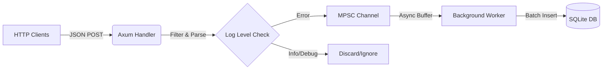

# High-Performance Log Ingester (Rust + Axum + SQLite)


> **"Speed of C, Simplicity of SQLite."**

A high-throughput, asynchronous log ingestion API designed for extreme performance and low latency. Built with **Rust**, **Axum**, and **Tokio**, this service leverages **AVX2 CPU optimizations** and **SQLite in WAL mode** to handle thousands of concurrent requests per second with **minimal resource footprint (~12.5 MB RAM)**.

This project demonstrates how to build a production-grade ingestion pipeline that decouples HTTP request handling from database I/O using the Actor Model pattern (MPSC Channels).

---

## 🚀 Key Features

* **⚡ Asynchronous Architecture:** Built on the **Tokio** runtime. The main thread is never blocked by database writes.
* **🪶 Ultra-Low Memory Footprint:** Runs on just **~12.5 MB RAM** under heavy load (Verified).
* **🛡️ Zero-Data-Loss Pipeline:** Uses a **Multi-Producer Single-Consumer (MPSC)** channel buffer to queue logs during high-traffic spikes.
* **💾 SQLite WAL Mode:** Configured with Write-Ahead Logging (WAL) for significantly improved write concurrency.
* **🏎️ Hardware Acceleration:** Compiled with `target-cpu=native` to utilize **AVX2** instructions for rapid JSON parsing.
* **🔍 Dynamic JSON Handling:** Automatically captures undefined fields into a JSON `details` column, ensuring schema flexibility.

---

## 🏗️ Architecture

The system follows a **Producer-Consumer** pattern to maximize throughput:



1. **Ingestion (Producer):** The Axum handler accepts JSON batches. It parses and filters logs in microseconds.
2. **Buffering:** Valid logs are sent to an in-memory channel. The HTTP response (`202 Accepted`) is returned immediately.
3. **Persistence (Consumer):** A dedicated background task picks up logs from the channel and writes them to SQLite using prepared statements.

---

## 📊 Benchmark Results

Tests were conducted on a local development machine using a multi-threaded Python script.

| Metric | Result |
| --- | --- |
| **Concurrency** | 50 Threads |
| **Throughput** | **~4,205+ RPS** (Requests Per Second) |
| **Total Writes** | ~42,000 records (in 10s) |
| **Memory Usage** | **~12.5 MB** 🤯 |
| **Failed Requests** | 0 (0%) |

> *Note: The benchmark bottleneck was identified as the Python load generator, not the Rust server. Actual capacity is likely much higher.*

---

## 🛠️ Getting Started

### Prerequisites

* Rust (latest stable)
* Cargo

### Installation & Running

To achieve maximum performance, build in **Release** mode with CPU-specific optimizations.

1. **Clone the repository:**
```bash
git clone [https://github.com/bannimus/log-ingestor.git](https://github.com/bannimus/log-ingestor.git)
cd log-ingestor

```


2. **Build and Run (Optimized):**
```bash
# Windows (PowerShell)
$env:RUSTFLAGS="-C target-cpu=native"; cargo run --release

# Linux / macOS
RUSTFLAGS="-C target-cpu=native" cargo run --release

```


The server will start on `http://0.0.0.0:3002`.

---

## 🧪 Testing

You can send a test log using `curl`:

```bash
curl -X POST http://localhost:3002/ingest \
  -H "Content-Type: application/json" \
  -d '{
    "level": "error",
    "message": "Database connection failed",
    "service": "payment-api",
    "retry_count": 3
  }'

```

### Verifying Data

The application automatically creates a `logs.db` SQLite file. You can query it to see the structured data:

```sql
SELECT * FROM logs ORDER BY id DESC LIMIT 5;

```

---

## 🔮 Future Roadmap

* [ ] Migration to PostgreSQL for horizontal scaling.
* [ ] Implementation of Batch Inserts for even higher throughput.
* [ ] Docker & Kubernetes deployment manifests.
* [ ] Authentication middleware (API Key).

---

**License:** MIT

```